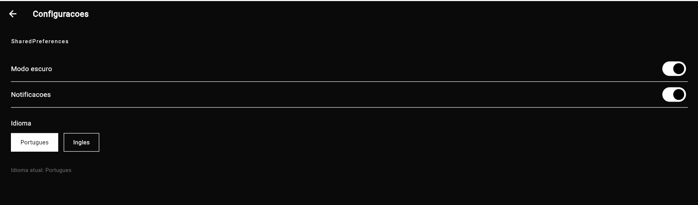
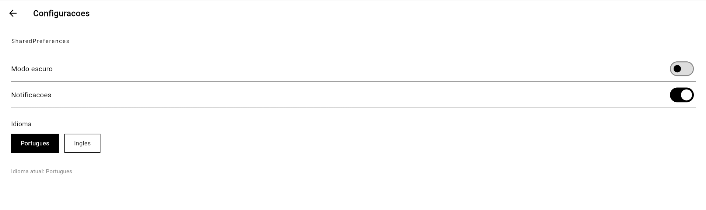
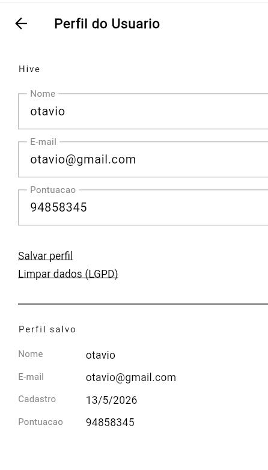

# LocalVault

**Aluno:** [Seu Nome]

Aplicativo Flutter demonstrando as três principais abordagens de persistência de dados local: SharedPreferences, Hive e flutter_secure_storage.

---

## Por que SharedPreferences para configurações?

Configurações como modo escuro, idioma e notificações são pares chave-valor simples e primitivos. O SharedPreferences é ideal para esse caso por ser leve, sem necessidade de schema, e com API direta para leitura e escrita de tipos básicos. Não faz sentido usar um banco de dados para armazenar três booleanos e uma string.

## Por que Hive para o perfil do usuário?

O perfil é um objeto estruturado com múltiplos campos tipados. O Hive oferece persistência de objetos Dart nativos via TypeAdapter, leitura rápida sem overhead de SQL, e funciona bem offline sem configuração de servidor. É mais adequado que SharedPreferences para dados estruturados e mais simples que SQLite para volumes pequenos.

## Por que flutter_secure_storage para o token?

Tokens de autenticação são dados sensíveis. O flutter_secure_storage usa o Keychain no iOS e o EncryptedSharedPreferences no Android, garantindo que o dado fique cifrado no armazenamento do sistema operacional. SharedPreferences e Hive salvam em texto simples acessível com root ou backup, o que seria inaceitável para credenciais.

---

## Como rodar o projeto

**Pré-requisitos:** Flutter SDK 3.x, Dart 3.x

```bash
# 1. Instalar dependências
flutter pub get

# 2. Rodar
flutter run
```





## Privacidade e LGPD

O app coletaria e armazenaria localmente: nome, e-mail e pontuação do usuário (Hive), preferências de uso (SharedPreferences) e um token de autenticação (armazenamento seguro do SO

Precisaria de uma política de privacidade visível antes do primeiro uso, tipo um termo de consentimento, consentimento explícito antes de salvar qualquer dado pessoal, e o botão delimpar dados já implementado na tela de perfil cobre o direito ao esquecimento para dados locais